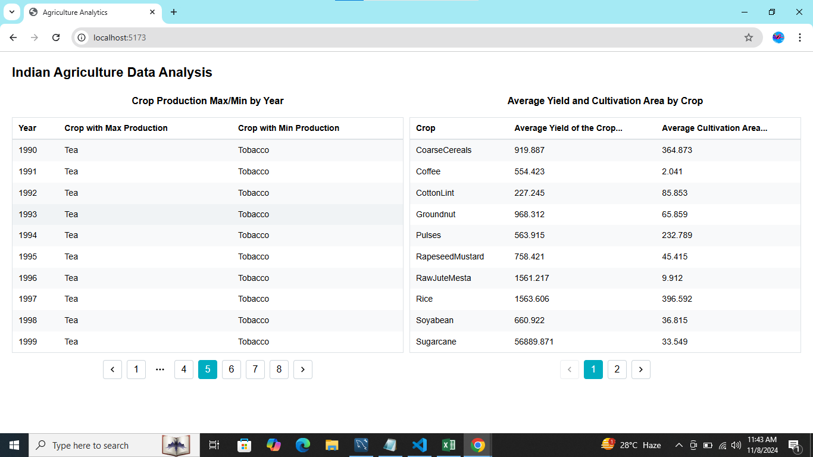

# Indian Agriculture Data Analysis

This project provides data analytics on Indian agriculture, focusing on crop production, yield, and cultivation areas. Using data from the National Data and Analytics Platform, the app allows users to view insights with sortable tables and pagination.

## Features

- **Table 1**: Displays the crop with the highest and lowest production by year.
- **Table 2**: Shows the average yield and area under cultivation for each crop from 1950 to 2020.
- **Pagination**: Allows viewing data in pages, with 10 rows per page.

## Technologies Used

- **TypeScript**
- **React with Vite**
- **Mantine for UI Components**
- **Mantine Pagination and Table Components**

## Folder Structure

AgricultureAnalytics/
├── public/
├── src/
│   ├── assets/                  # Folder containing screenshots
│   ├── components/              # Folder containing table components
│   │   ├── CropTableMaxMin.tsx  # Component for max/min production table
│   │   └── CropTableAverage.tsx # Component for average yield/area table
│   ├── data/
│   │   └── cropsData.json       # JSON file with crop data
│   ├── utils/
│   │   └── dataProcessing.ts    # Utility functions for data processing
│   ├── App.tsx                  # Main app component
│   └── main.tsx                 # Entry point
├── index.html
├── package.json
└── README.md

# Installation
Prerequisites
Node.js
Yarn (or npm)

Steps
Clone the repository:
git clone https://github.com/ayush7078/Agriculture-Analytics.git

cd AgricultureAnalytics

# Install dependencies:
yarn install

Start the development server:
 yarn dev

Open your browser and go to http://localhost:5173/ to view the app.

# Usage
Pagination: Each table is paginated to show 10 rows per page. Use the pagination controls at the bottom of the table to navigate through pages.

# Screenshots

Here are some screenshots of the project:

1. 
2. 
3.  
4.  
5. 
6. 
7.  
8.  

# Data Source
The data used in this project comes from the National Data and Analytics Platform (NDAP) provided by NITI Aayog.

# Project Details
Developed By: Ayush Porwal
Email: ayushporwal7078@gmail.com
